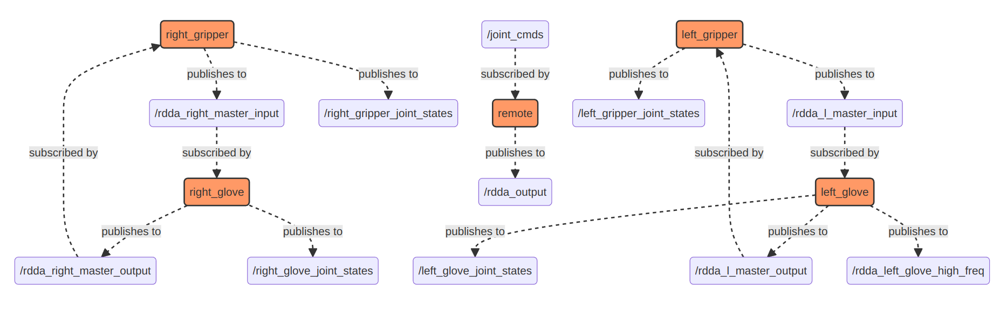

## Avatar Behavior Cloning

### Introduction
This project entails implementing diffusion policy based BC on the avatar platform. 

### Installation
1. Install Bazel from [here](https://docs.bazel.build/versions/master/install.html)
2. Run `bazel build //...` in the root directory of the project
3. Run `bazel run //simulate:avatar_simple_py` to run the avatar simulation with just one arm. For two, use `bazel run //simulate:avatar_dual_arm_py`

4. In case of issues, try running the test via `bazel test //...` 

### How to videos for running the hardware - 
 - [Turning the system on and other checks (Water/Air Pressure)](https://youtu.be/b0CZYSwcIk0) Youtube Video Link (unlisted)
 - Documentation for running the software - https://avatar-wiki.readthedocs.io/en/latest/instructions.html

### Coupling Control Flow Diagram

## ROS2 Avatar Repos 

- [rdda_avatar](https://github.com/adeeb10abbas/rdda_avatar)
- [rdda_interface_types](https://github.com/adeeb10abbas/rdda_interface_types)
- [smarty_arm_interface](https://github.com/adeeb10abbas/smarty_arm_interface)
- [smarty_arm_msg](https://github.com/adeeb10abbas/smarty_arm_msg)
